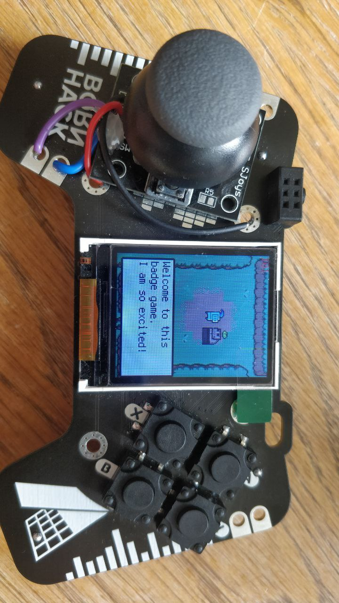

# Badge adventure

This is a very small game you can put on a [BornHack 2022 Game On Badge](https://github.com/bornhack/badge2022). Feel free to change anything as you see fit.



## Requirements

- A `BornHack 2022 Game On Badge`
- The badge running [CircetPython](https://circuitpython.org/).
- An analog stick connected to your badge using pins: `A2` and `A3`, this is configured in `gamepad.py`
  - Or simular that works with [AnalogIn](https://learn.adafruit.com/circuitpython-essentials/circuitpython-analog-in)

## Installation

*Remember to backup your current badge code*

1. Copy the files from the `src/` onto your `BornHack 2022 Game On Badge`
2. Reboot the badge

## Make your own changes

- Change the name and color on the splash screen by editing `splashscreen.py`
- You can choose how your player looks editing `player.py`

```python
PLAYER_SPRITE = "/game_data/player_3.bmp" # Existing player sprites sheets: player_0 to player_10
```

- Change the world by editing the `game_data/world_map.csv`. It is easiere to edit it using [Tiled Map Editor](https://www.mapeditor.org/), open the `game_data/world_map.tmx` and when you are happy with your changes export a new .csv file
